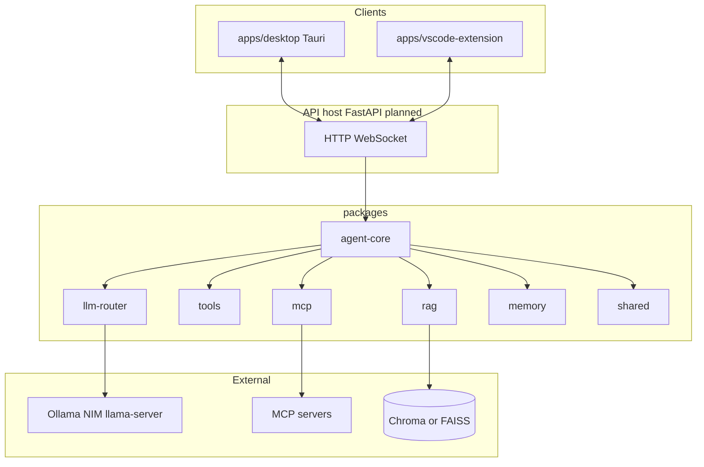

# System architecture

**產品核心**：本地優先的 AI coding assistant；支援 Ollama、可選 NIM、MCP、RAG、多檔編輯、終端、桌面與 VS Code。

**主計畫**：`docs/PROJECT_MASTER_PLAN.md`。

---

## 1. 設計原則

1. **單一編排進程**：LLM 呼叫、工具執行、RAG、MCP 由同一 **FastAPI** 宿主載入（宿主目錄於 Phase 0 建立，見 `tasks/phase_0_setup.md`）。
2. **雙殼、一後端**：`apps/desktop`（Tauri）與 `apps/vscode-extension` 僅負責 UI／編輯器整合，不重複 agent 邏輯。
3. **packages 為邏輯核心**：`packages/agent-core` 等可被 FastAPI 以本機 package 方式匯入（路徑對齊於 Phase 0）。
4. **參考 repo 不進 build**：`cline-main` 等僅供閱讀；依賴以官方發佈物為準。
5. **LLM 可替換**：`packages/llm-router` 對齊 Ollama 與 OpenAI 相容端點（含 NIM、`llama-server`）。

---

## 2. 邏輯架構



---

## 3. Monorepo 實體結構（本 skeleton）

```
.
├── apps/
│   ├── desktop/                 # Tauri + React + TypeScript
│   └── vscode-extension/      # VS Code extension
├── packages/
│   ├── agent-core/
│   ├── llm-router/
│   ├── tools/
│   ├── rag/
│   ├── memory/
│   ├── mcp/
│   └── shared/
├── docs/
├── tasks/
└── PROJECT_MASTER_PLAN.md     # 可為導向 docs 之 stub
```

**說明**：歷史目錄（若仍存在）如根層 `backend/`、`frontend/`、`agent/` 等**不屬**本 skeleton；Phase 0 清理或遷移，以 `apps/` + `packages/` 為準。

---

## 4. 模組邊界

| 路徑 | 職責 |
|------|------|
| `packages/agent-core` | Tool loop、對話狀態、取消、步數／token 預算 |
| `packages/llm-router` | 供應商無關的 chat／stream 介面與設定 |
| `packages/tools` | 內建工具實作與註冊表 |
| `packages/mcp` | MCP 傳輸與工具列表合併；不實作第三方 server |
| `packages/rag` | Chunk、embed、索引、查詢 |
| `packages/memory` | 專案記憶讀寫抽象 |
| `packages/shared` | 設定模型、錯誤型別、共用常數 |
| `apps/desktop` | 視窗、本機檔案／終端橋、與 API 通訊 |
| `apps/vscode-extension` | 命令、設定、與同一 API 通訊 |

---

## 5. 向量後端（待 Phase 2 鎖定）

| 欄位 | 狀態 |
|------|------|
| 預設向量後端（Chroma / FAISS） | **未決定** |

---

## 6. 安全邊界（架構層）

- 工作區根路徑：所有檔案與終端預設限於該樹。
- 終端：allowlist 或逐步確認（見 `docs/mvp_definition.md`）。
- MCP：每 server 獨立啟停與能力白名單。

---

## 7. 文件維護

變更架構時同步更新本檔、`docs/repository_analysis.md`（若影響依賴）、`docs/roadmap.md`。
