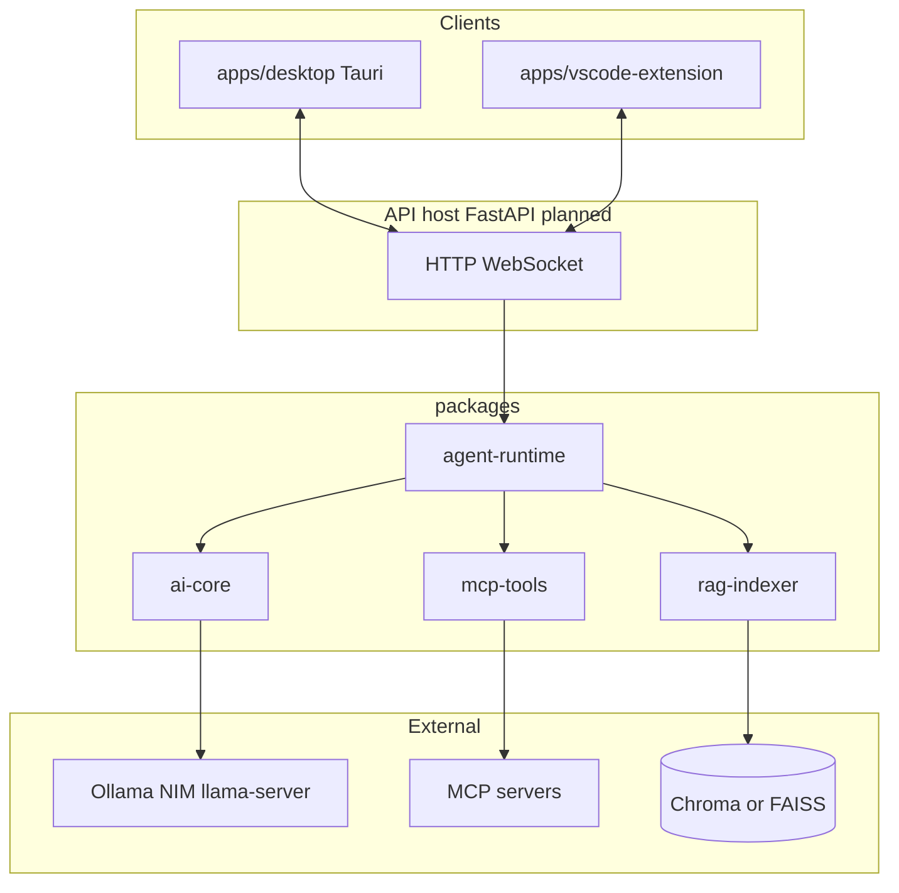

# System architecture

**產品核心**：本地優先的 AI coding assistant；支援 Ollama、可選 NIM、MCP、RAG、多檔編輯、終端、桌面與 VS Code。

**主計畫**：`docs/PROJECT_MASTER_PLAN.md`。

---

## 1. 設計原則

1. **單一編排進程**：LLM 呼叫、工具執行、RAG、MCP 由同一 **FastAPI** 宿主載入（宿主目錄於 Phase 0 建立，見 `tasks/phase_0_setup.md`）。
2. **雙殼、一後端**：`apps/desktop`（Tauri）與 `apps/vscode-extension` 僅負責 UI／編輯器整合，不重複 agent 邏輯。
3. **packages 為邏輯核心**：`packages/ai-core`、`packages/agent-runtime` 等由 FastAPI 宿主匯入（宿主目錄於 Phase 0 建立）。
4. **參考 repo 不進 Git**：`cline-main` 等僅本機 clone；根 `.gitignore` 已排除，依賴以官方發佈物為準。
5. **LLM 可替換**：`packages/ai-core` 對齊 Ollama 與 OpenAI 相容端點（含 NIM、`llama-server`）。

---

## 2. 邏輯架構



---

## 3. Monorepo 實體結構（本 skeleton）

```
.
├── apps/
│   ├── desktop/                 # Tauri + React（預留）
│   └── vscode-extension/        # VS Code extension
├── packages/
│   ├── ai-core/                 # LLM／prompt／共用抽象
│   ├── agent-runtime/           # Agent 執行期、tool loop
│   ├── mcp-tools/               # MCP 客戶端與工具整合
│   └── rag-indexer/             # RAG 索引與檢索
├── docs/
├── scripts/
├── tasks/
├── .gitignore                   # 排除 vendor／大型媒體／模型等
└── PROJECT_MASTER_PLAN.md     # stub → docs/PROJECT_MASTER_PLAN.md
```

**說明**：上游 mirror（`cline-main` 等）請僅本機擁有，勿提交；已列於根 `.gitignore`。若歷史中仍被追蹤，需另執行 `git rm -r --cached` 後再 commit。

---

## 4. 模組邊界

| 路徑 | 職責 |
|------|------|
| `packages/ai-core` | LLM 介面、供應商設定、prompt／型別共用 |
| `packages/agent-runtime` | Tool loop、對話狀態、取消、步數／token 預算 |
| `packages/mcp-tools` | MCP 傳輸、工具列表合併；不實作第三方 server |
| `packages/rag-indexer` | Chunk、embed、索引、查詢 |
| `apps/desktop` | 視窗、本機檔案／終端橋、與 API 通訊（預留） |
| `apps/vscode-extension` | 命令、設定、與後端／Ollama 通訊 |
| `scripts/` | 建置、索引、release 輔助腳本 |

---

## 5. 向量後端（待 Phase 2 鎖定）

| 欄位 | 狀態 |
|------|------|
| 預設向量後端（Chroma / FAISS） | **未決定** |

---

## 6. 安全邊界（架構層）

- 工作區根路徑：所有檔案與終端預設限於該樹。
- 終端：allowlist 或逐步確認（見 `docs/mvp_definition.md`）。
- MCP：每 server 獨立啟停與能力白名單。

---

## 7. 文件維護

變更架構時同步更新本檔、`docs/repository_analysis.md`（若影響依賴）、`docs/roadmap.md`。
